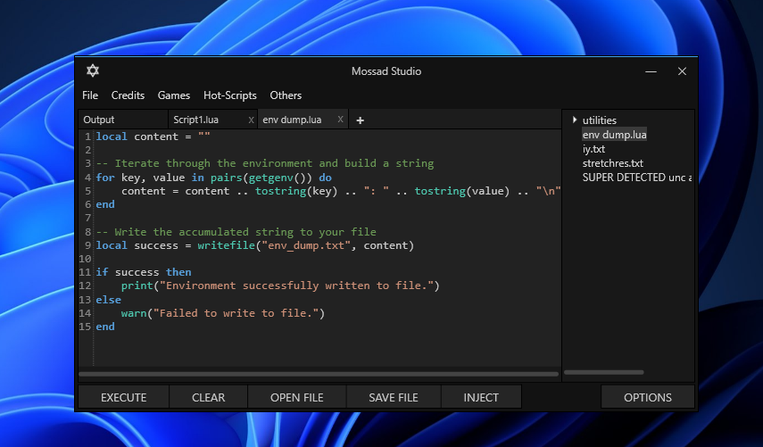

# ✡️ Mossad Studio

Welcome to Mossad Studio, the custom UI for SirHurt V5.
It was inspired by KRNL Legacy UI, which was long ago discontinued. So I've decided not only to recreate it, but to add some new features and Quality of Life improvements not seen in the original UI.
This custom UI was built with .NET 10 and modern libraries to make it simpler and faster!

## Features

- AvalonEdit and Monaco editor with updated Luau syntax highlighting with ability to load custom .d.luau files (and convert to .xshd when AvalonEdit is enabled)
- Output tab to see all actions coming from MossadStudio and SirHurt
- Script Hub powered by Rscripts.net
- Built-in SirHurt Cleaner
- Flags for experienced users (if you are not - don't touch it)
- ~~sirhurt_secure encryption toggle~~ (Work In Progress, to be implemented in the future)
- Bootstrapper to stay updated on the latest version of UI and SirHurt
- ...and more!

## Installation

1. Download the latest executable release from the [releases](https://github.com/malichevsky/MossadStudio/releases) page.
2. Create a folder and place MossadStudio.exe in it.
3. Run the executable.
4. Enjoy!!

## To-do

- [x] Toggle to enable Monaco editor and back to AvalonEdit
- [x] As well to implement Monaco editor with Luau LSP, will work under MS WebView2 since CEF is heavy.
- [x] Ability to load custom .d.luau files (and convert to .xshd when AvalonEdit is enabled)
- [x] Remove FPS unlocker since it is no longer revelant
- [ ] Add ability to encrypt scripts with `sirhurt_secure` library and execute them.
- [x] Get rid of Discord RPC, no longer revelant
- [ ] Add ability to show SirHurt injection console as a separate window (by default the window is hidden and all output is redirected to the output tab)
